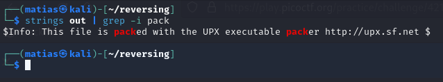
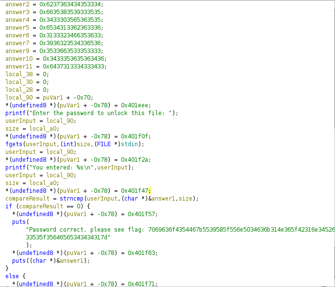

Ok, so. As the name points, we are probably dealing with a packed binary.

If we do `readelf -S <binary>` we can see there are no headers or useful information. This is an indicator the binary may be packed.
Also, if we run `strings` on the binary, and filter for "pack", we have some extra data. 

In Ghidra, we could look for the same string, and get the same result. 

So, we now unpack the binary `upx -d <binary>` and open it on Ghidra again. After finish the analysis, there is a `main` function in the "Symbol Tree" window. Let's open it, and we have this:

This is the complete text: 
`Password correct, please see flag: 7069636f4354467b5539585f556e5034636b314e365f42316e345269 33535f35646565343434317d`

After we convert it from hex to ascii, we get the flag.