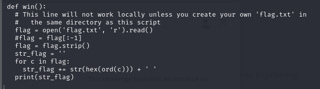

This is a python code. We download the file, open it, and at the bottom shows:

So, the program will print a string, then it'll ask for our input, save it on the "user_input" variable, and pass it as an argument to the `eval()` function. 

Inspecting the code, there are a few functions, but this one is clearly interesting:

This function will look for a "flag.txt" file on the same directory, read it's content and print each character in hex. 
After creating a flag file, with the string "flag{mock_flag}", I execute the binary, and pass the argument "win". This is the output:

We put that output on CyberChef, and we have our mock flag string.
Now we can run the binary remotely and send the same input.
